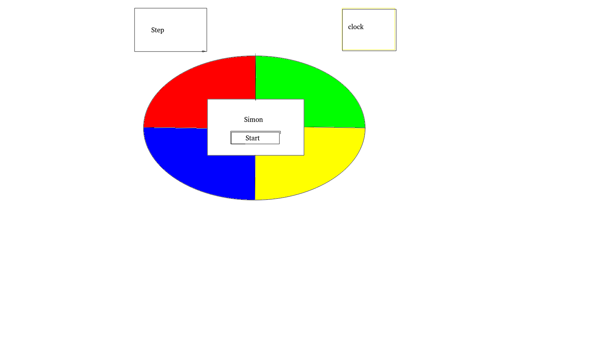
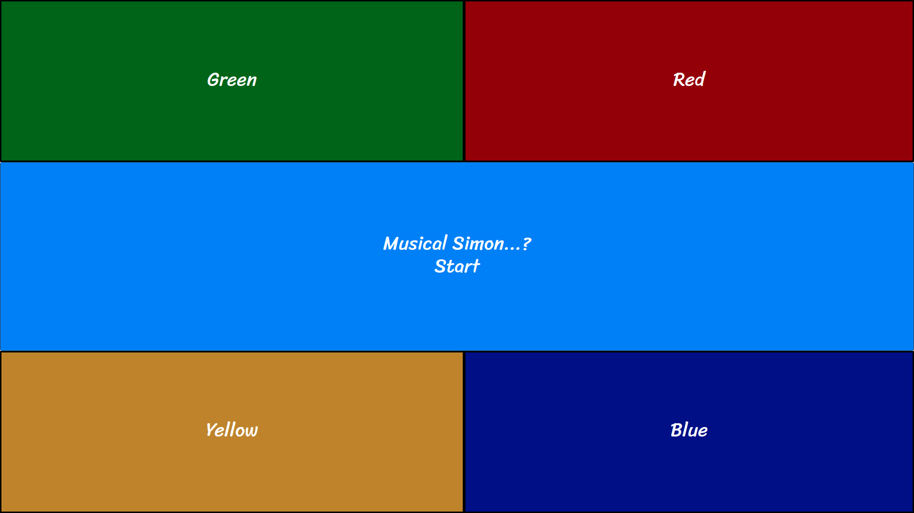
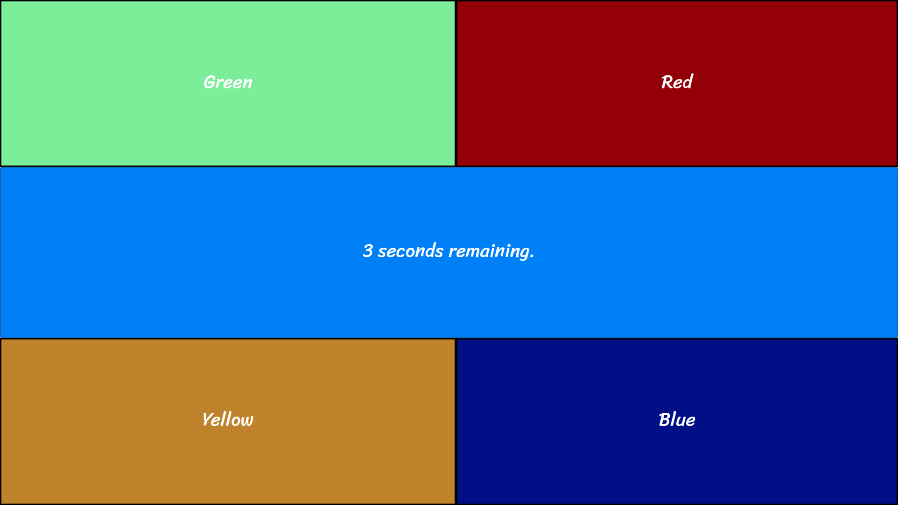
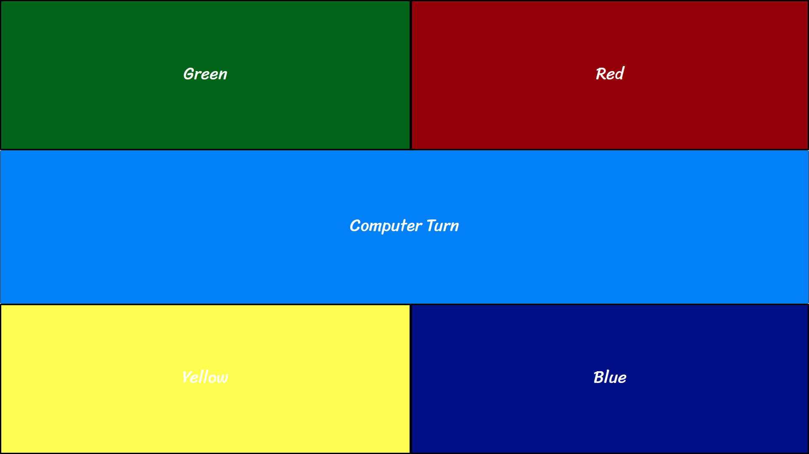

# Project-One
<h2>Simon</h2>

Simon is a memory based game that challenges you dynamically by adding steps to the sequence and increasing the tempo.  
This game was originally developed by Ralph H. Baer and Howard J. Morrison as a toy electronic game. 

<h2>Objective:</h2>

Create a browser-based game that models off of the electronic game: Simon

<h2>Play the Game!</h2>

<a href="https://zeroxposur18.github.io/Simon/" target="_blank">Open game!</a>  
To begin playing this game, Click on the Start button!

<h2>Prototype View:</h2>

<h2>Screenshots</h2>

<h2>Technologies Used</h2>

This program was built with: 
 
- JavaScript  
- HTML  
- CSS  
- Audacity  
- Git
<h2>Next Steps</h2>
1. Circular Application  
2. Application downsized and center  
3. Background image added 
4. Finding and adding original Simon soundfiles 
5. Some form of Animation to the color flash