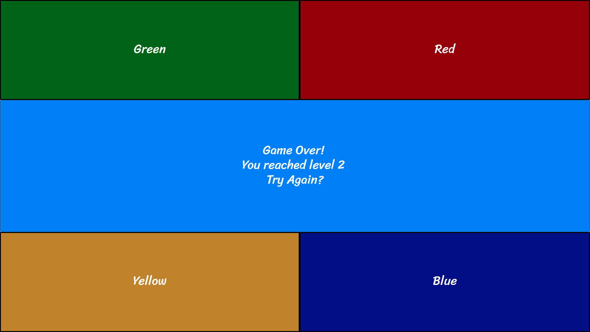

# Project-One
<h2>Simon</h2>

Simon is a memory based game that challenges you dynamically by adding steps to the sequence and increasing the tempo.  
This game was originally developed by Ralph H. Baer and Howard J. Morrison as a toy electronic game. 

<h2>Screenshots</h2>

<h2>Technologies Used</h2>

This program was built with JavaScript, HTML, CSS and Audacity

<h2>Getting Started</h2>

 <a heref="https://zeroxposur18.github.io/Simon/" target="_blank">Open Game!</a> 
To begin the game, press the Start button!

<h2>Next Steps</h2>